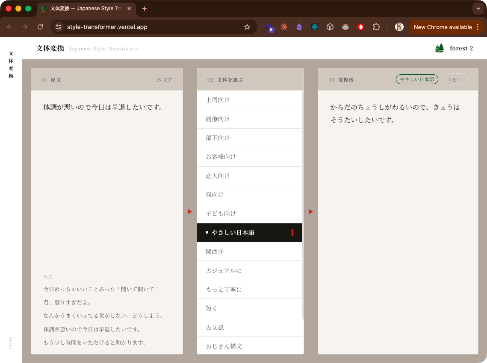

# 文体変換 — Style Transformer

日本語の文章を、相手や状況に合わせた文体に変換するツールです。

[](https://github.com/forest-2/style-transformer/actions/workflows/ci.yml)

---

## ハッカソンについて

このプロダクトは **[全日本AIハッカソン](https://www.aifestival.jp/hackathon)（2026年3月28日開催）** にて、**3時間**で制作しました。

- **チーム：** [@kanare-dev](https://github.com/kanare-dev) / [@omizu-k](https://github.com/omizu-k)
- **開発：** [Claude Code](https://claude.ai/claude-code) + [v0](https://v0.dev) MCP を活用
- **テーマ：** 当日発表。テーマは **「communication」**

ことばのトーンを相手に合わせることが、真のcommunicationだという思想のもと、このツールを設計しました。

---

## デモ画面



---

## 機能

- **15種類の文体変換：** 上司向け・同僚向け・やさしい日本語・関西弁・おじさん構文・犬向け など
- **ストリーミング生成：** 変換結果をリアルタイムで表示
- **例文選択：** ワンクリックでサンプル文章を入力
- **コピー：** 変換後の文章をワンクリックでコピー
- **レスポンシブ：** モバイルでも縦積みレイアウトで快適に使用可能

---

## 技術スタック

| レイヤー       | 技術                     |
|---------------|--------------------------|
| フレームワーク  | Next.js 15 (App Router)  |
| 言語           | TypeScript               |
| AI             | OpenAI API (streaming)   |
| ランタイム      | Bun                      |
| Lint           | Biome                    |
| テスト          | Vitest + Testing Library |
| ホスティング    | Vercel                   |

---

## ローカル起動

```bash
# 依存関係インストール
bun install

# 環境変数設定
cp .env.example .env.local
# .env.local に OPENAI_API_KEY を設定

# 開発サーバー起動
bun dev
```

[http://localhost:3000](http://localhost:3000) を開くと使えます。

---

## 開発コマンド

```bash
bun dev              # 開発サーバー起動
bun run build        # プロダクションビルド
bun run test:ci      # テスト実行
bunx biome check .   # Lint + フォーマットチェック
```
